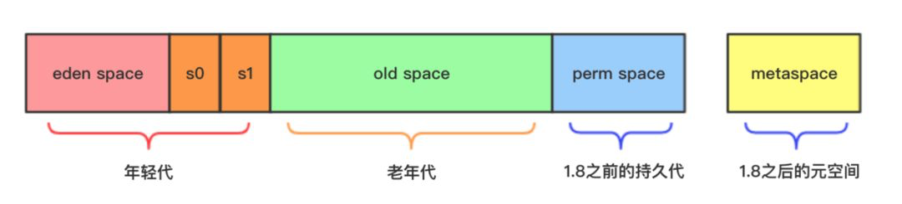

# cms

## :book: CMS参数：

| 参数名称                                  | 参数作用                                                                                                                                                                   |
| ------------------------------------- | ---------------------------------------------------------------------------------------------------------------------------------------------------------------------- |
| -XX:+UseParNewGC                      |                                                                                                                                                                        |
| -XX:+UseConcMarkSweepGC               |                                                                                                                                                                        |
| -XX:ParallelGCThreads                 | Sets the number of threads used during parallel phases of the garbage collectors. The default value varies with the platform on which the JVM is running.              |
| -XX:ParallelCMSThreads                |                                                                                                                                                                        |
| -XX:MaxTenuringThreshold              | 对象从新生代晋升到老年代的年龄阈值（每次 Young GC 留下来的对象年龄加一），默认值15，表示对象要经过15次 GC 才能从新生代晋升到老年代。设置太小会严重影响 CMS GC 性能，建议默认值即可。                                                                |
| -XX:+UseCMSCompactAtFullCollection    | 这个参数表示开启 Full GC 时的压缩功能，减少内存碎片。默认开启                                                                                                                                    |
| -XX:CMSFullGCsBeforeCompaction        | 多少次Full GC 后压缩old generation一次。默认0                                                                                                                                     |
| -XX:+UseCMSInitiatingOccupancyOnly    | 只是用设定的回收阈值(上面指定的70%),如果不指定,JVM仅在第一次使用设定值,后续则自动调整.                                                                                                                      |
| -XX:CMSInitiatingOccupancyFraction    | 是指设定CMS在对内存占用率达到70%的时候开始GC                                                                                                                                             |
| -XX:+CMSClassUnloadingEnabled         |                                                                                                                                                                        |
| -XX:+CMSScavengeBeforeRemark          |                                                                                                                                                                        |
| -XX:+CMSParallelRemarkEnabled         |                                                                                                                                                                        |
| -XX:ConcGCThreads                     | The flag -XX:ConcGCThreads= (in earlier JVM versions also known as -XX:ParallelCMSThreads) defines the number of threads with which the concurrent CMS phases are run. |
| -XX:SurvivorRatio=8                   | Eden区与Survivor区的大小比值                                                                                                                                                   |
| -XX:MaxTenuringThreshold              | 新生代需要经历多少次GC晋升到老年代中的最大阈值                                                                                                                                               |
| -XX:+PrintGCDateStamps                | 打印 GC 发生的时间戳。                                                                                                                                                          |
| -XX:+PrintTenuringDistribution        | 打印 GC 发生时的代龄信息。                                                                                                                                                        |
| -XX:+PrintGCApplicationStoppedTime    | 打印 GC 停顿时长                                                                                                                                                             |
| -XX:+PrintGCApplicationConcurrentTime | 打印 GC 间隔的服务运行时长                                                                                                                                                        |
| -XX:+PrintGCDetails                   | 打印 GC 详情，包括 GC 前/内存等。                                                                                                                                                  |
| -Xloggc                               | 指定 GC log 的路径                                                                                                                                                          |

*   查看jvm中的各种参数以及默认值：

    * `标准参数：`

    java

    * 非标准参数（-X）

    java -X

    * 非Stable参数（-XX）

    java -XX:+PrintFlagsFinal

    java -XX:+PrintCommandLineFlags

## :book: 内存分布

#### 1. CMS

<figure><figcaption></figcaption></figure>

#### 2. G1

#### 3. ZGC

## :link: 参考文章

* [Java中9种常见的CMS GC问题分析与解决](https://mp.weixin.qq.com/s?\_\_biz=MjM5NjQ5MTI5OA==\&mid=2651754955\&idx=1\&sn=8411133d2e5f22b9e2c5a34cdc67985d\&scene=21#wechat\_redirect)
